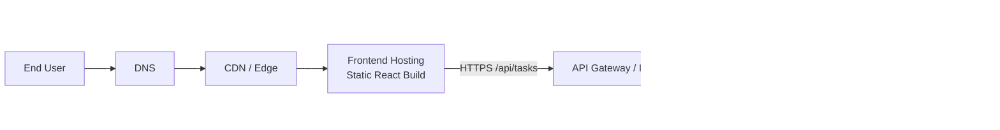
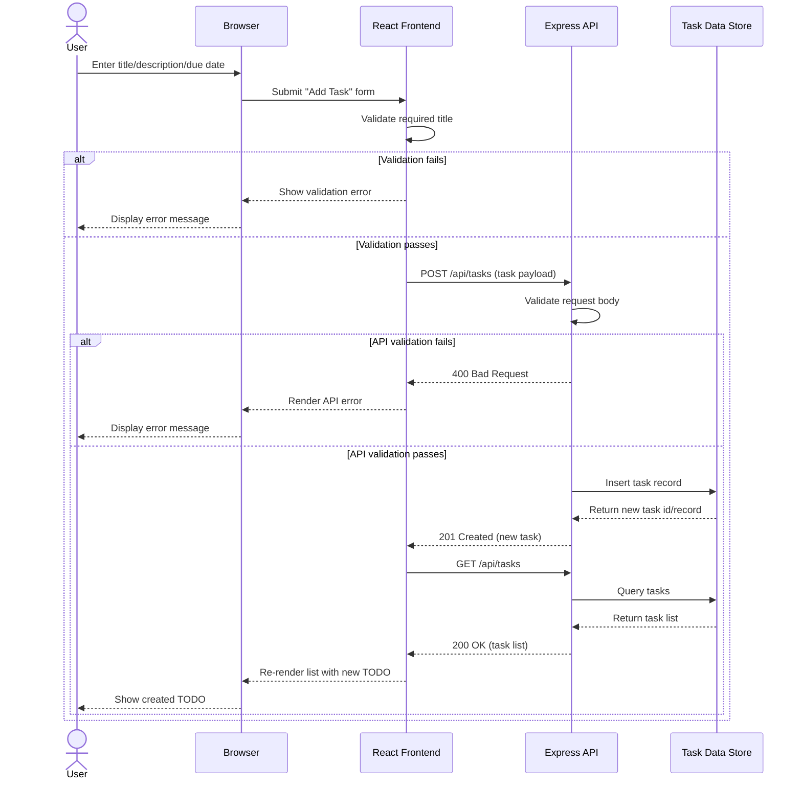

# Cloud Architecture Overview

This document provides a simple system context view for the TODO app monorepo.

## System Context

```mermaid
flowchart LR
    U[End User]
    B[Web Browser]

    subgraph Cloud[Cloud Runtime]
      FE[Frontend App\nReact (packages/frontend)]
      API[Backend API\nExpress (packages/backend)]
      DB[(Task Data Store\nSQLite in-memory)]
    end

    U --> B
    B -->|HTTPS| FE
    FE -->|HTTP /api/tasks| API
    API --> DB
```

## Component Notes

- Frontend: React single-page app served to browser clients.
- Backend: Express API exposing task endpoints under `/api/tasks`.
- Data store: SQLite in-memory database used by backend process.
- Current scope: single-user/local-style persistence behavior as defined in project requirements.

## Future-State Deployment View



### Future-State Notes

- Frontend is hosted as static assets behind CDN/edge caching.
- API traffic is routed through an ingress layer before reaching backend service instances.
- Database moves from in-memory SQLite to a managed persistent SQL service.
- Monitoring and logs are centralized for API and gateway telemetry.

## Sequence: Create TODO


